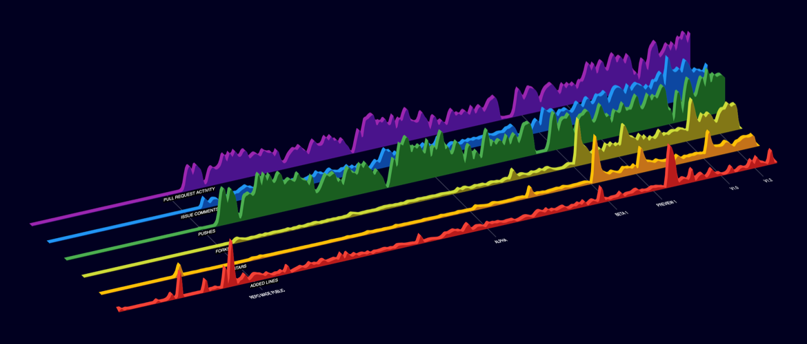

Welcome to our Data Visualization demo for Flutter Web. This was part of the initial set of demos for Flutter Web when it was announced at Google I/O 2019. This project uses activity data from the [main Flutter github repository](https://github.com/flutter/flutter) over the four year lifespan of the project, then plots it in an animated layered chart.

More details are available on the [project page on our website](https://www.larvalabs.com/project/github-dataviz-flutter-web).

### How to run the app

Make sure you have installed the Flutter tooling and enabled web development, instructions are at [flutter.dev/web](https://flutter.dev/web).

Then just run the app in chrome:

    $ flutter run -d chrome
